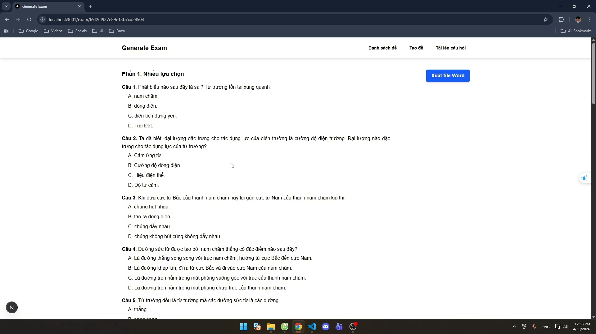

# Website sinh đề tự động (Exam Creation App)

## Demo Video

## Mục tiêu dự án
Ứng dụng web hỗ trợ giáo viên tự động hóa quá trình tạo đề kiểm tra, từ việc số hóa ngân hàng câu hỏi đến xuất bản đề thi chuẩn hóa.

## Các tính năng cốt lõi (Đã hoàn thành)
- **Xử lý tài liệu:** Upload và tự động bóc tách dữ liệu từ file `.docx`, chuyển đổi và lưu trữ có cấu trúc vào MongoDB.
- **Sinh đề tự động:** Tạo đề kiểm tra dựa trên cấu trúc của công văn 7991.
- **Trải nghiệm người dùng:** Xem trước (preview) giao diện đề thi và hỗ trợ tải xuống đề kiểm tra sau khi tạo thành công.

## Công nghệ sử dụng
- **Frontend:** Next.js
- **Backend:** NestJS
- **Cơ sở dữ liệu:** MongoDB Atlas